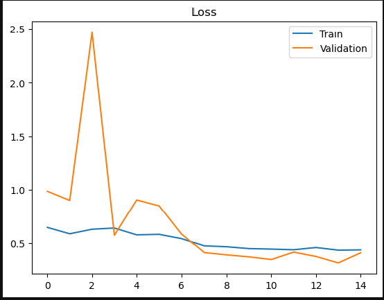
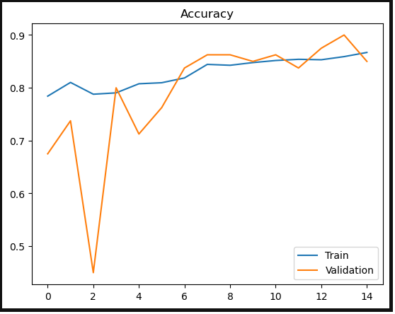

# Multi-Class Image Classification using ResNet50

# 1. Project Overview

The Image Classification of Five Flower Classes project aims to build a machine learning model capable of classifying images of flowers into one of the five predefined classes: **Rose**, **Tulip**, **Sunflower**, **Daisy**, and **Dandelion**. The primary goal is to create a reliable system that can automatically identify and categorize different types of flowers based on input images. This project has applications in botany, horticulture, and image recognition tasks.

# 2. Project Structure and Dependencies

## 2.1. Structure

- `requirements.txt`
    - Project dependencies.
- `Codes`
    - `Final_ResNet.ipynb`
        - Code for **ResNet50**.
    - `Final_Model.ipynb`
        - Code for other models.
- `main.py`
    - This is flask implementation for the project.
- `final.pkl`
    - This is the model saved as a pickle file.

## 2.2. Dependencies

Ensure you have the following dependencies installed:

- Python 3.x
- TensorFlow
- NumPy
- Pandas
- Matplotlib and Seaborn
- Scikit-learn
- OpenCV
- Jupyter Notebook

# 3. Dataset Description

- Link for the dataset is given below:
    
    [Flower Classification](https://www.kaggle.com/datasets/sauravagarwal/flower-classification)
    
    
- The dataset used is the one that is already partitioned.

# 4. Data Augmentation

- Data augmentation is a crucial technique in image classification tasks, especially when dealing with limited training data.
- It involves applying various transformations to the original images to create new training samples.
- This process not only increases the size of the training dataset but also helps improve the model's generalization by exposing it to different variations of the same data.
- In this project, data augmentation was applied using the **`ImageDataGenerator`** class provided by the `Keras` library.
- The **`ImageDataGenerator`** allows for on-the-fly data augmentation, ensuring that each batch of images provided to the model during training is slightly different, reducing overfitting and improving the model's ability to generalize to unseen data.
- The following augmentations were used:
    - **Rotation**: Randomly rotates the image by a certain degree.
    - **Width and Height Shift**: Shifts the width and height of the image by a fraction of its total width and height.
    - **Shear**: Applies shear mapping to the image.
    - **Zoom**: Randomly zooms into or out of the image.
    - **Horizontal Flip**: Flips the image horizontally.

# 5. Model Architecture

The image classification model in this project is built using a modified `ResNet-50` architecture, which is a deep convolutional neural network (CNN) pre-trained on the `ImageNet` dataset. This section outlines the key components and layers of the model architecture.

## ResNet50 Base Model

- The base of our model is ResNet-50, which is loaded with pre-trained weights from the ImageNet dataset. The input shape of the model is set to (224, 224, 3), indicating that it accepts color images with dimensions 224x224 pixels.
- To prevent the pre-trained ResNet-50 layers from being updated during training and to retain their valuable features, we freeze all layers in the base model.
- On top of the ResNet-50 base, we add custom classification layers to adapt the model to our specific task of flower classification.
    - **Global Average Pooling Layer**: Global Average Pooling reduces the spatial dimensions of the feature maps while retaining important information. It's a form of dimensionality reduction.
    - **Dense Layers with Dropout**: We follow the Global Average Pooling layer with several fully connected Dense layers, each with a ReLU activation function to capture complex patterns in the data. Dropout layers with a dropout rate of 0.5 are added after each Dense layer to reduce overfitting.
    - **Output Layer**: The final output layer consists of a Dense layer with a `softmax` activation function, producing five output classes, one for each flower category.

# 6. Training and Evaluation

- Before training, we compiled the model with the following configurations:
    - **Optimizer:** We used the `Adam` optimizer, which is a popular choice for training deep neural networks.
    - **Loss Function:** For this multi-class classification task, we used the `categorical cross-entropy` loss function, which is well-suited for optimizing models that output probability distributions over multiple classes.
- We used a batch size of 32, meaning that the model was updated after processing each batch of 32 images.
- The training process was set to run for 10 epochs, which means that the entire training dataset was processed 10 times.
- We used the test dataset generated by the **`test_generator`** to evaluate the model's performance on previously unseen images.

# 7. Results

The results section provides an overview of the performance and outcomes of our image classification project, including the model's accuracy, visualizations, and any additional insights gained from the experiment.






## Final results are as follows:

-The test loss is:  0.5963686108589172
-The best accuracy is:  86.00000143051147

# 8. Deployment

## Flask Implementation

To deploy the image classification model, we have implemented a Flask web application. Flask is a lightweight web framework for Python that allows us to create a web server and serve our machine learning model as an API.

Here's a brief overview of the deployment steps:

1. **Flask Web Application (`main.py`):**
   - The `main.py` file contains the Flask application code. It defines the routes and handles requests.
   - We use the Flask `render_template` function to render the HTML templates and provide the user interface for interacting with the model.

2. **Model Loading (`final.pkl`):**
   - The trained model is saved as a pickle file (`final.pkl`).
   - In the Flask application, we load the model using a library like `joblib` or `pickle` at the beginning of the script.

3. **Request Handling:**
   - When a user submits an image through the web interface, the Flask server receives the request.
   - We preprocess the image (resize, normalize, etc.) to match the input requirements of the model.

4. **Model Prediction:**
   - The preprocessed image is passed through the loaded model for prediction.
   - The model predicts the class probabilities, and the Flask application returns the result to the user.

5. **User Interface (`templates` folder):**
   - The `templates` folder contains the HTML templates for the web pages.
   - The user interacts with the deployed model through a simple web interface, where they can upload an image for classification.

## Running the Flask Application Locally

To run the Flask application locally:

```bash
# Navigate to the project directory
cd /path/to/your/project

# Unzip the pickle file if compressed
unzip final.pkl.zip

# Run the Flask application
python main.py


